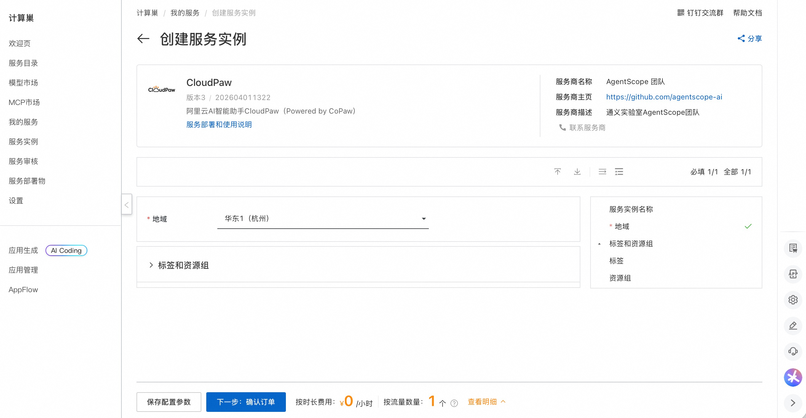
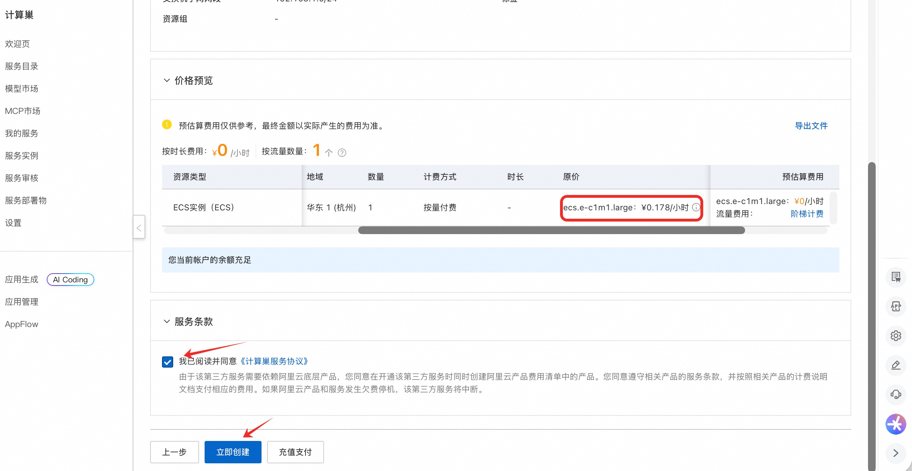
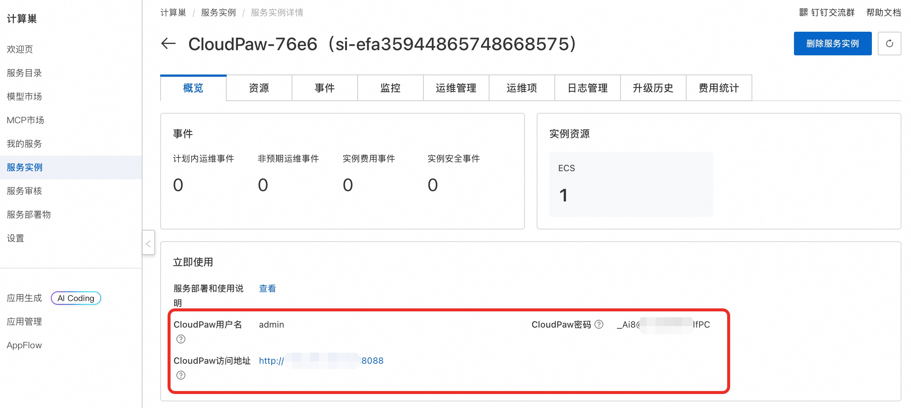
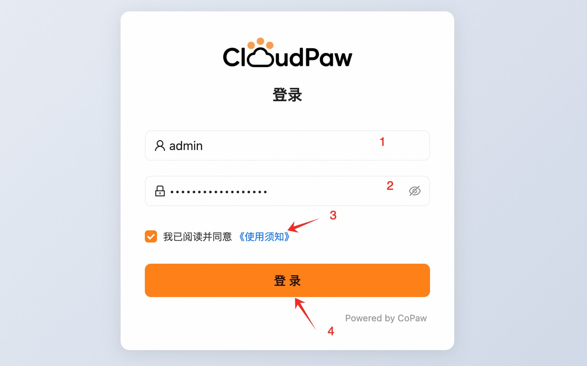
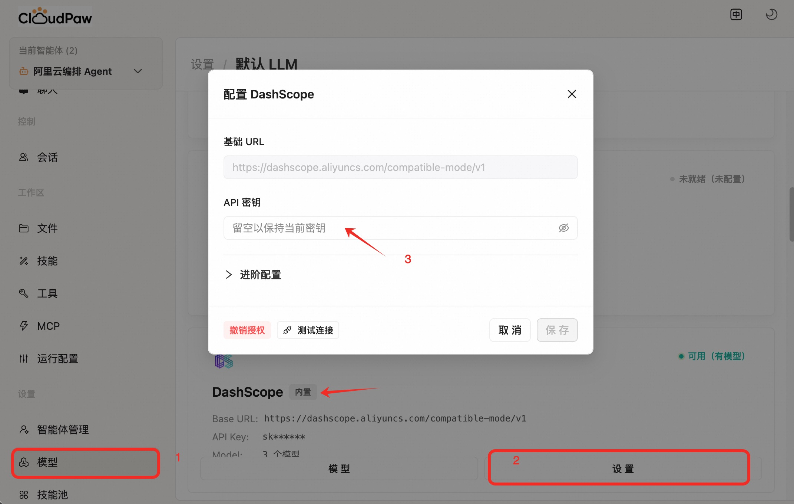
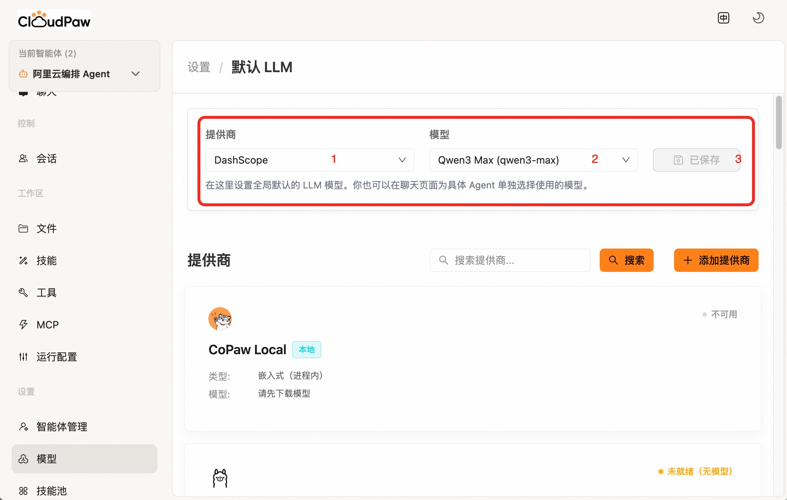
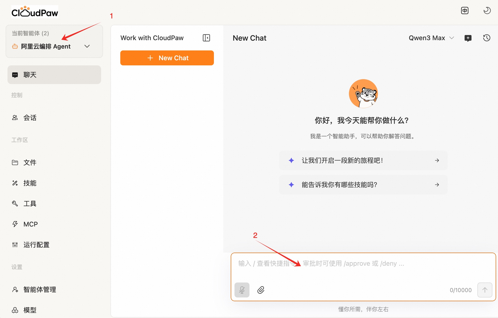
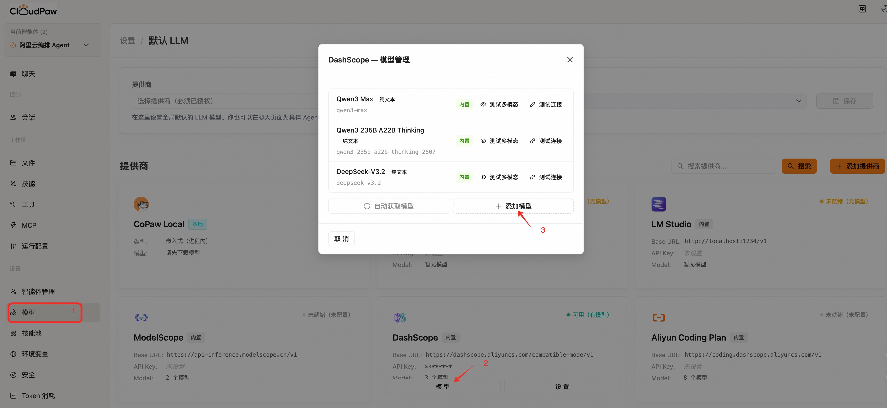

  

# CloudPaw 服务使用说明

## 概述
CloudPaw 是 [CoPaw](https://copaw.agentscope.io/) 衍生出的阿里云 AI 助手，融合 **CoPaw + Aliyun CLI** 两大核心组件，并深度集成 **ROS（资源编排）** 能力——它不是简单的聊天机器人，而是一个具备云原生执行引擎的智能助手。

只需用自然语言描述你的需求，CloudPaw 就能自动完成从资源创建到应用部署的全流程。例如：

- **一句话搭建应用**：告诉 CloudPaw "帮我搭建一个私有网盘"，它会自动创建 ECS 实例、配置安全组、部署应用并返回可访问的地址。
- **个人站点秒级上线**：描述你想要的页面内容和风格，CloudPaw 自动生成代码、部署到云端、绑定公网访问。
- **API 服务快速发布**：指定接口定义，CloudPaw 完成从代码生成、容器构建到服务暴露的整个链路。

CloudPaw 完全部署在您自己的环境中，数据安全可控。本文向您介绍如何通过计算巢快速部署 CloudPaw 服务，以及基本使用说明。

## 部署流程

1. 访问计算巢 CloudPaw [部署链接](https://computenest.console.aliyun.com/service/instance/create/cn-hangzhou?spm=5176.24779694.0.0.48ab4d22uORwmU&type=user&ServiceId=service-ea1d139a460a4a9ea649)，直接点击 **下一步：确认订单**：

    

2. 在订单确认页，核对实例费用，点击 **立即创建** 开始自动部署：

    

3. 部署完成后，在服务实例详情页获取访问地址、用户名和密码：

    

4. 访问服务地址，输入上一步获取的用户名和密码，阅读并同意使用协议后，点击 **登录**：

    

5. 配置百炼 API Key（[获取百炼 API Key](https://bailian.console.aliyun.com/cn-beijing/?tab=globalset#/efm/api_key)），也可选择其他模型服务，请按需配置：

    

6. 配置模型，请按需选择合适的模型：

    

## 验证结果

部署完成后，使用**阿里云编排 Agent**（默认）进行对话，验证服务是否正常运行：

## 使用 CloudPaw

您可以尝试以下示例场景，体验 CloudPaw 的能力：

**场景一：快速搭建私有网盘**

> 我想快速搭建一个私有网盘服务，能够通过网页访问、上传下载文件、管理用户权限，并支持基本的文档在线预览功能。我希望整个部署过程尽量简化，不需要手动配置服务器环境、安装依赖或调试Web服务，而是通过一种自动化的方式完成应用的初始化和基础设置。部署完成后，我希望能直接通过浏览器访问网盘首页，使用默认管理员账号登录并开始使用，同时确保数据存储具备基本的持久性，不会因服务重启而丢失。

**场景二：创建个人主页并上线**

> 我叫 StackWalker，帮我创建一个个人主页并上线到云端。我希望页面包含：个人介绍、技能、项目经历、联系方式。风格尽量简洁清爽，适配手机和电脑。

**场景三：快速发布 API 服务**

> 我叫 StackWalker，帮我把一个 API 服务快速发布到云端。我希望默认提供 /health 和 /hello 两个接口，并给我可直接调用的地址和示例请求，配置尽量简单清晰。

## 常见问题

### 如何配置百炼其他模型？

进入 **设置 > 模型 > 添加模型**，输入模型 ID 后点击创建即可：

## 联系我们

遇到问题或有任何建议，欢迎通过以下方式联系我们：

